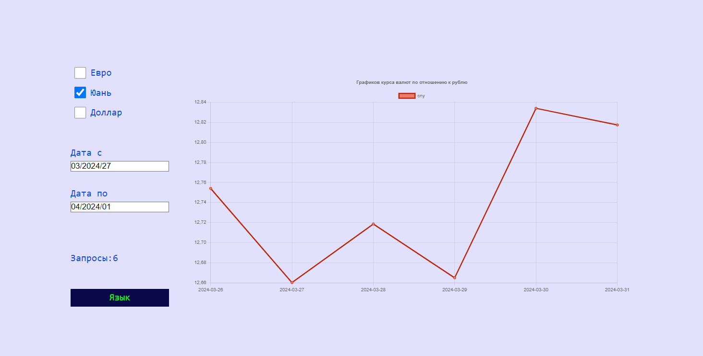

# График курсов валют

Одностраничное приложение для
отображения графиков курса трех валют по отношению к рублю.



## Установите необходимые зависимости :

```bash
yarn install
# or
npm install
```
## Старт :

```bash
yarn start
# or
npm run start
```

## Стек :

- [React](https://react.dev/learn)
- [react-chartjs-2](https://react-chartjs-2.js.org/)
- [chartjs](https://www.chartjs.org/docs/latest/)
- [Redux-Toolkit](https://redux-toolkit.js.org/)
- [FSD](https://feature-sliced.design/ru/docs)
